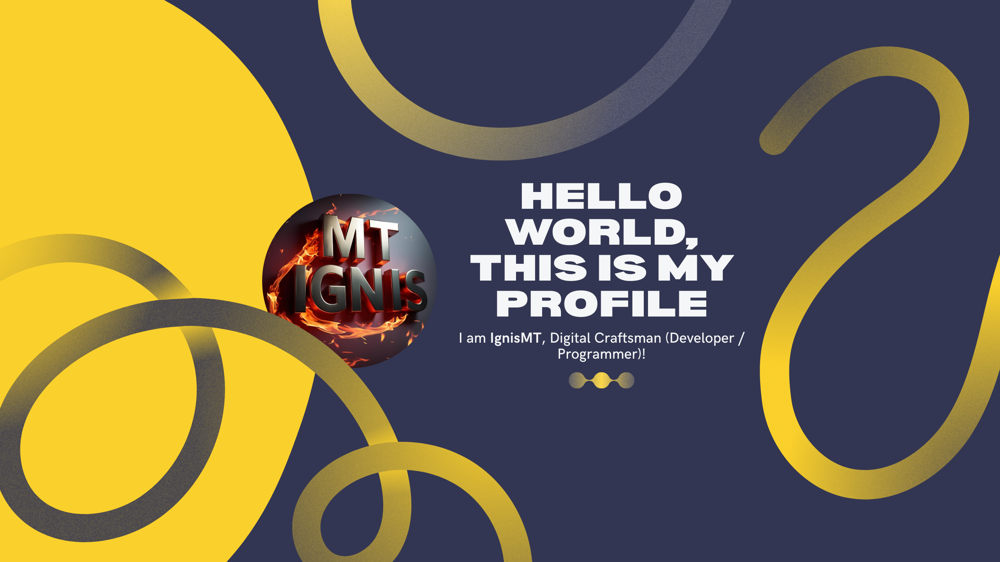

<h1 align="center">
   
  IgnisMT 
  
</h1>

<!-- Animación de texto dinámico -->
<div align="center">
  
</div>

<!-- ============================================= -->
<!-- BANNER PRINCIPAL Y PORTADA -->
<!-- ============================================= -->

<div align="center" style="margin: 0; padding: 0;">
  <!-- Banner superior animado con gradiente -->
  
  
  <!-- Banner personalizado (asegúrate de que Banner.png esté en tu repositorio) -->
  
</div>

<!-- ============================================= -->
<!-- BADGES DE ESTADÍSTICAS -->
<!-- ============================================= -->

<p align="center" style="margin-top: 10px;">
  <!-- Contador de visitas al perfil -->
  
  
  <!-- Contador de seguidores -->
  
  
  <!-- Badge personalizado de enfoque -->
  
</p>

<!-- ============================================= -->
<!-- GALERÍA MULTIMEDIA -->
<!-- ============================================= -->

<div align="center">
  <!-- Imagen de entorno de multiprogramación -->
  
  
  <!-- Imagen de Octocats -->
  
</div>

<br>

<!-- ============================================= -->
<!-- SECCIÓN DE TROFEOS DE GITHUB -->
<!-- ============================================= -->

##  GitHub Trophies

<div align="center">
  
</div>

<!-- ============================================= -->
<!-- SECCIÓN SOBRE MÍ (TARJETA DE PRESENTACIÓN) -->
<!-- ============================================= -->

##  Sobre Mí

<!-- Objeto que describe mi perfil profesional -->
```javascript
const ignisMT = {
  country: "Costa Rica 🇨🇷",
  languages: ["Spanish", "English"],
  role: "Full Stack Developer & DevOps Engineer",
  currentlyLearning: "Everything useful for growth",
  lookingToCollaborate: ["Open source projects", "Innovative ideas"],
  askMeAbout: ["DevOps", "Web Dev", "Tech", "Cloud Architecture"],
  interests: ["Music 🎵", "Anime 🎬", "Sports 🏀", "Coding 💻"],
  challenges: "Actualmente aprendiendo algo nuevo cada día",
  goal: "Contribuir a proyectos que impacten positivamente",
  funFact: "Ignis significa 'fuego' en latín ⚡"
};
```

<!-- ============================================= -->
<!-- SECCIÓN DE TECNOLOGÍAS Y HERRAMIENTAS -->
<!-- ============================================= -->

##  Tecnologías y Herramientas

<!-- Animación de habilidades centrada en la parte superior -->
<div align="center">
  <picture>
    <source media="(prefers-color-scheme: dark)" srcset="./Skills_Animation_Dark.gif">
    <source media="(prefers-color-scheme: light)" srcset="./Skills_Animation_White.gif">
    
  </picture>
</div>

<br>

<!-- Lista de tecnologías organizadas por categorías -->
<div align="center">

###  Frontend
<!-- Tecnologías de desarrollo frontend -->
       

###  Backend
<!-- Lenguajes y frameworks de backend -->
      

###  Bases de Datos
<!-- Sistemas de gestión de bases de datos -->
   

###  Cloud & DevOps
<!-- Plataformas cloud y herramientas DevOps -->
   

###  Herramientas de Desarrollo
<!-- IDEs y herramientas de desarrollo -->
     

###  Monitoreo & Visualización
<!-- Herramientas de monitoreo y métricas -->
 

###  Diseño
<!-- Herramientas de diseño UI/UX -->


###  Otros
<!-- Otras tecnologías -->


</div>
<br clear="both"/>

<!-- ============================================= -->
<!-- MENSAJE MOTIVACIONAL -->
<!-- ============================================= -->

<div align="center">
  <i> Recuerda: El código es poesía escrita en lógica </i>
</div>

<br>

<!-- ============================================= -->
<!-- SECCIÓN DE ESTADÍSTICAS DE GITHUB -->
<!-- ============================================= -->

## 📊 GitHub Stats

<!-- Estadísticas generales y lenguajes más usados -->
<p align="center">
  <a href="https://github.com/ignismt">
    
    
  </a>
</p>

<!-- Racha de contribuciones -->
<div align="center">
  
</div>

<!-- Gráfico de actividad de contribuciones -->
<div align="center">
  
</div>

<!-- ============================================= -->
<!-- SECCIÓN DE CONTACTO Y REDES SOCIALES -->
<!-- ============================================= -->

##  Conéctate Conmigo

<div align="center">
  <a href="https://github.com/ignismt">
    
  </a>
  <a href="#">
    
  </a>
  <a href="#">
    
  </a>
  <a href="#">
    
  </a>
</div>

<!-- TODO: Agregar enlaces reales a las redes sociales cuando estén disponibles -->

<!-- ============================================= -->
<!-- SEPARADOR Y ANIMACIÓN SNAKE -->
<!-- ============================================= -->

---

<!-- Animación de serpiente de GitHub (adapta según el tema) -->
<picture>
  <source media="(prefers-color-scheme: dark)" srcset="https://raw.githubusercontent.com/IgnisMT/IgnisMT/output/github-snake-dark.svg" />
  <source media="(prefers-color-scheme: light)" srcset="https://raw.githubusercontent.com/IgnisMT/IgnisMT/output/github-snake.svg" />
  
</picture>

<!-- ============================================= -->
<!-- MENSAJE MOTIVACIONAL FINAL -->
<!-- ============================================= -->

<div align="center">
  <i> Recuerda: El código es poesía escrita en lógica </i>
</div>

<!-- ============================================= -->
<!-- CITA DEL DÍA -->
<!-- ============================================= -->

##  Quote of the Day

<!--STARTS_HERE_QUOTE_CARD-->
<p align="center">
    
</p>
<!--ENDS_HERE_QUOTE_CARD-->

<!-- ============================================= -->
<!-- FOOTER ANIMADO -->
<!-- ============================================= -->

<div align="center" style="margin: 0; padding: 0;">
  
</div>
